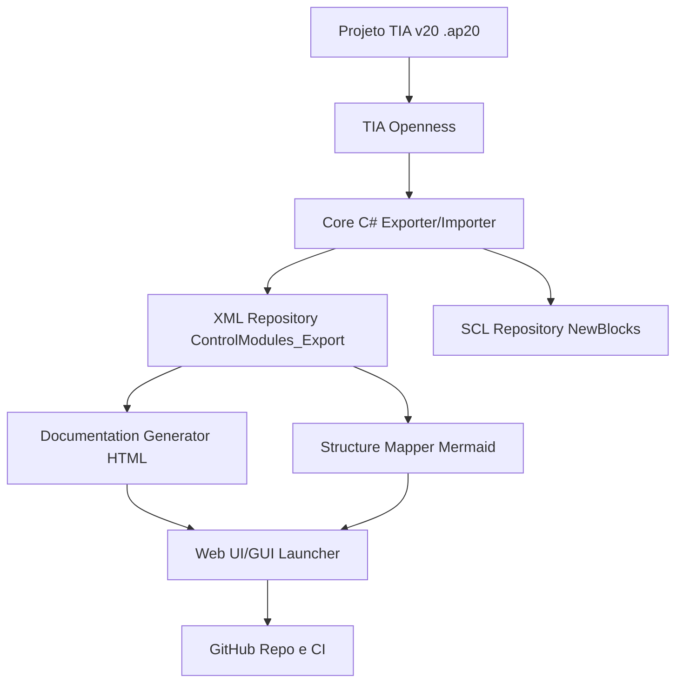

# Base para GitHub - Plataforma de Engenharia TIA

## 1) Visao
Construir uma plataforma colaborativa para ler, exportar, documentar e mapear projetos TIA Portal (S7-1500), com foco em rastreabilidade, automacao e onboarding rapido de novos colaboradores da Puchta.

## 2) Problema atual
- Conhecimento de arquitetura de blocos fica disperso e dependente de especialistas.
- Exportacao/importacao exige comandos manuais e contexto tecnico.
- Falta visualizacao padronizada da estrutura funcional do projeto.
- Erros de encoding, caminhos e permissao podem quebrar o fluxo.

## 3) Objetivos de produto
- Permitir executar exportacao/importacao/documentacao sem friccao.
- Gerar mapa de estrutura do projeto em Mermaid para entendimento rapido.
- Padronizar fluxo de engenharia para qualquer projeto TIA suportado.
- Preparar base para crescimento em GitHub (issues, releases, contribuicao).

## 4) Requisitos funcionais (MVP+)
1. Conectar ao TIA Openness em modo Attach e Headless (fallback automatico).
2. Exportar OB/FB/FC recursivamente para XML por bloco.
3. Importar SCL/UDT a partir de pasta padrao (NewBlocks).
4. Gerar documentacao HTML de blocos exportados.
5. Interface Web com botoes: Exportar, Importar, Ciclo Completo, Documentacao.
6. Popup de estrutura Mermaid carregando por API (`/api/mermaid`).
7. Monitor de logs com API (`/api/logs`).
8. Controle de scripts permitidos por allowlist no servidor web.

## 5) Requisitos nao funcionais
- Compatibilidade: Windows 10/11 + TIA Portal V20.
- Confiabilidade: scripts com codificacao UTF-8 e validacao de parse.
- Segurança: limitar scripts executaveis via API.
- Observabilidade: logs por execucao e mensagens claras em portugues.
- Manutenibilidade: organizacao por scripts pequenos e responsabilidades claras.

## 6) Arquitetura proposta (alto nivel)

## 7) Padrao de dados e contratos
- Entrada exportacao: projeto aberto no TIA (ou .ap20 para headless).
- Saida exportacao: `Logs/ControlModules_Export/**/*.xml`.
- Entrada importacao: `Logs/NewBlocks/*.scl` e `*.udt`.
- Saida documentacao: `DocumentacaoDoProjeto.html`.
- API Web:
  - `POST /api/run` body `{ "script": "..." }`
  - `GET /api/logs`
  - `GET /api/mermaid`

## 8) Backlog inicial para GitHub (issues)
1. Modo strict de exportacao (falhar por taxa minima de sucesso).
2. Mapa Mermaid por hierarquia real de pastas e blocos (nivel configuravel).
3. Exportar metadados para JSON (alem do HTML).
4. Testes automatizados de scripts PowerShell (Pester).
5. Pipeline CI para lint/parse e verificacao de encoding UTF-8.
6. Pacote de release com checksum e changelog automatico.
7. Documentacao de contribuicao para novos colaboradores Puchta.
8. Modo multi-projeto (selecionar caminho dinamico no frontend).

## 9) Estrutura recomendada de repositorio
- `src/Exporter/` (C# exporter)
- `src/Importer/` (C# importer)
- `scripts/` (PowerShell de operacao)
- `web/` (WebServer + frontend)
- `docs/` (arquitetura, onboarding, mermaid)
- `samples/` (projetos/artefatos de exemplo)
- `.github/workflows/` (CI)

## 10) Definicao de pronto (DoD)
- Script principal executa sem erro de parse.
- Fluxo Exportar + Documentar + Visualizar Mermaid funciona ponta a ponta.
- Logs e mensagens em portugues.
- Arquivos novos com UTF-8 e sem corrupcao de caracteres.
- Atualizacao registrada no `Logs/AI_SYNC.md`.

## 11) Colaboracao Codex + Gemini
- Codex: lideranca tecnica, integracao, validacoes end-to-end e estabilidade.
- Gemini: especificacao funcional, UX/documentacao e criterios de aceite.
- Protocolo: toda alteracao relevante deve ser registrada no `AI_SYNC.md`.
