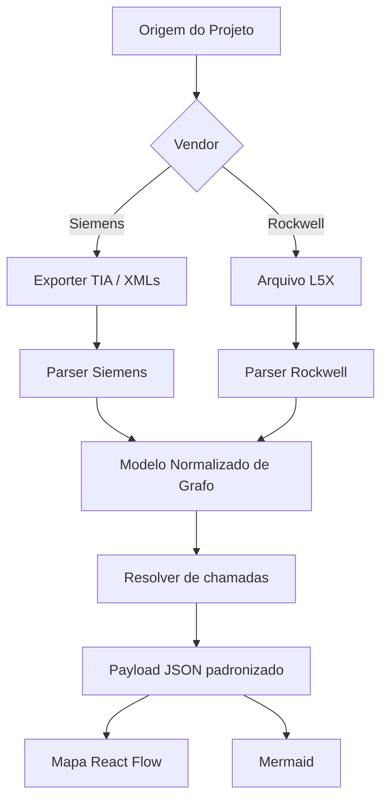

# Base para GitHub - Puchta PLC Insight

## 1. Visao
Construir uma plataforma colaborativa para ler, exportar, documentar e mapear logica de automacao industrial multi-vendor, com foco inicial em Siemens e Rockwell.

## 2. Posicionamento oficial
- Nome do produto: `Puchta PLC Insight`
- Nome legado: `TIA Map`
- Status do nome legado: manter apenas como referencia historica em logs antigos
- Subtitulo recomendado: `Mapa e analise de logica Siemens e Rockwell`

## 3. Problema atual
- O fluxo atual ainda mistura duas experiencias: painel legado em `8080` e mapa React em `5173`.
- A selecao de vendor aparece tarde demais, quando o usuario ja entrou no mapa.
- Parte da documentacao principal ainda descreve o projeto como Siemens-only.
- O backend ja suporta Rockwell inicial, mas a UX ainda nao foi reorganizada para refletir isso desde a entrada do sistema.

## 4. Definicoes oficiais vigentes
- O produto passa a ser tratado como plataforma multi-vendor.
- O usuario deve escolher `Siemens`, `Rockwell` ou `Auto` antes da carga da pasta/projeto.
- A escolha de vendor deve ficar junto da configuracao da origem de dados.
- A tela do mapa deve herdar o vendor escolhido e mostrar apenas filtros coerentes com o contexto atual.
- Toda nova analise deve validar encoding UTF-8, ou aplicar fallback tolerante, antes de gerar Mermaid.
- O backend deve continuar entregando um JSON padronizado para a UI, independentemente do vendor.

## 5. Objetivos de produto
- Permitir selecionar vendor e origem do projeto na interface principal.
- Unificar experiencia do painel principal com o mapa tecnico.
- Suportar Siemens e Rockwell usando contratos comuns de grafo.
- Gerar Mermaid e visualizacao estrutural coerentes com o vendor selecionado.
- Preparar base para crescimento em GitHub com backlog, issues e releases claros.

## 6. Requisitos funcionais prioritarios
1. Seletor de vendor na interface principal, antes da selecao de pasta.
2. Persistencia de vendor em `Logs/web_settings.json`.
3. Endpoint de grafo com `vendor=auto|siemens|rockwell`.
4. Parser Siemens baseado em XML exportado do TIA.
5. Parser Rockwell L5X baseado em `xml.etree.ElementTree`, com foco em `Task -> MainProgram -> Routine -> JSR`.
6. Legenda e cores coerentes por vendor.
7. Geracao de Mermaid coerente com o vendor selecionado.
8. Filtros dinamicos no mapa conforme o vendor herdado da tela principal.

## 7. Cores oficiais do mapa
### Siemens
- `OB`: roxo
- `FB`: azul
- `FC`: verde
- `DB/Tags`: cinza

### Rockwell
- `MainProgram`: vermelho
- `Routine`: verde
- `AOI`: azul
- `Tags/Data`: cinza

## 8. Arquitetura alvo

## 9. Contratos de dados
- Entrada Siemens: pasta com XMLs exportados (`Logs/ControlModules_Export`, `ControlModules_Export` ou `Export`)
- Entrada Rockwell: arquivo `.L5X` ou pasta contendo `.L5X`
- Saida de grafo:
  - `nodes`
  - `edges`
  - `vendor`
  - `projectId`
  - `source`
- API principal:
  - `GET /api/graph/{project_id}?vendor=auto|siemens|rockwell`
  - `GET /api/mermaid`
  - `GET /api/execution-mermaid`
  - `GET /api/logs`

## 10. Backlog estrategico
1. Mover seletor de vendor para a interface principal legado/web manager.
2. Unificar `8080` e `5173` em um unico ponto de entrada operacional.
3. Gerar Mermaid multi-vendor no backend novo.
4. Adicionar cache para `/api/graph` em projetos grandes.
5. Melhorar a deteccao automatica da origem pelo vendor.
6. Criar modo comparativo de versoes de projeto.
7. Padronizar documentacao de contribuicao para Siemens e Rockwell.

## 11. Definicao de pronto para a proxima fase
- O nome `Puchta PLC Insight` aparece na interface principal e no mapa.
- O vendor e escolhido antes da pasta/projeto.
- O mapa abre ja no contexto correto, sem pedir vendor novamente.
- O backend responde com payload multi-vendor consistente.
- Mermaid e grafo visual usam semantica correta do vendor.
- Toda alteracao relevante registrada em `Logs/AI_SYNC.md`.

## 12. Colaboracao Codex + Gemini
- Codex: arquitetura, backend, integracao, validacao end-to-end e auditoria tecnica.
- Gemini: UX, fluxo da interface principal, copy de produto e criterio de aceite visual.
- Protocolo: toda alteracao relevante deve ser registrada no `Logs/AI_SYNC.md`.
